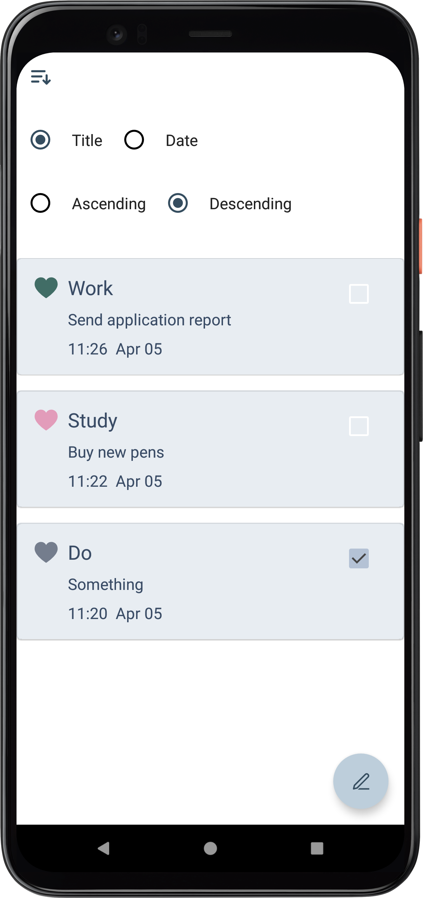
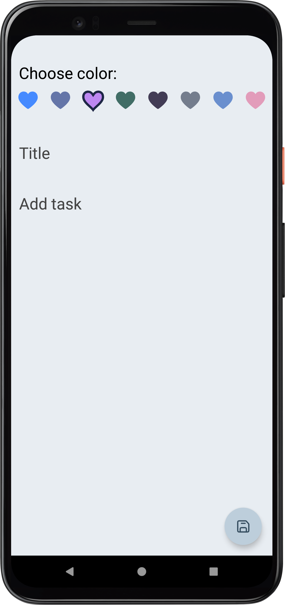
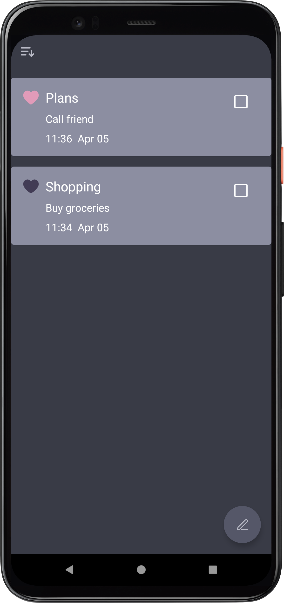
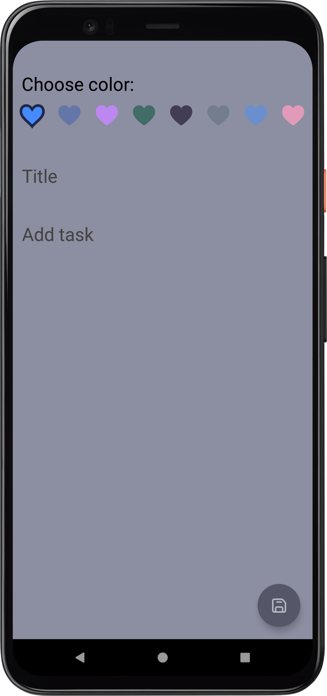

# dotApp
Dot. is a to-do list built with Android Jetpack

# Screenshots
<h3> Light and Dark theme </h3>

 

# Tech
* Android Jetpack
   * Android KTX
   * ViewModel
   * LiveData
   * Room
   * Compose
   * Navigation
* Kotlin Coroutines
  * Flow
* Dagger Hilt
